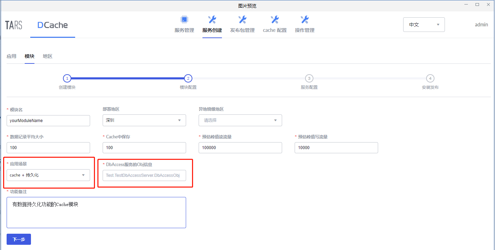
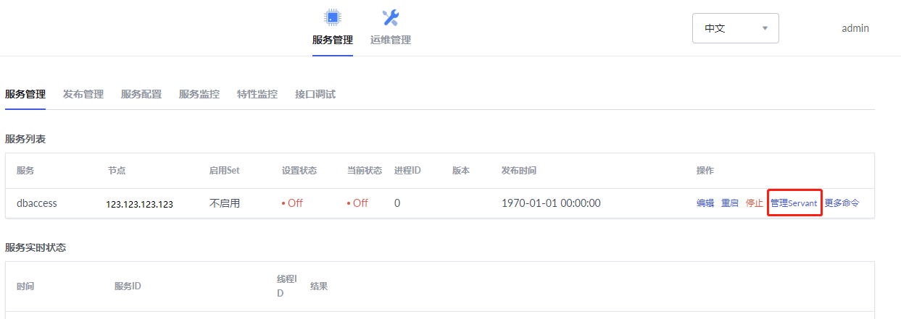
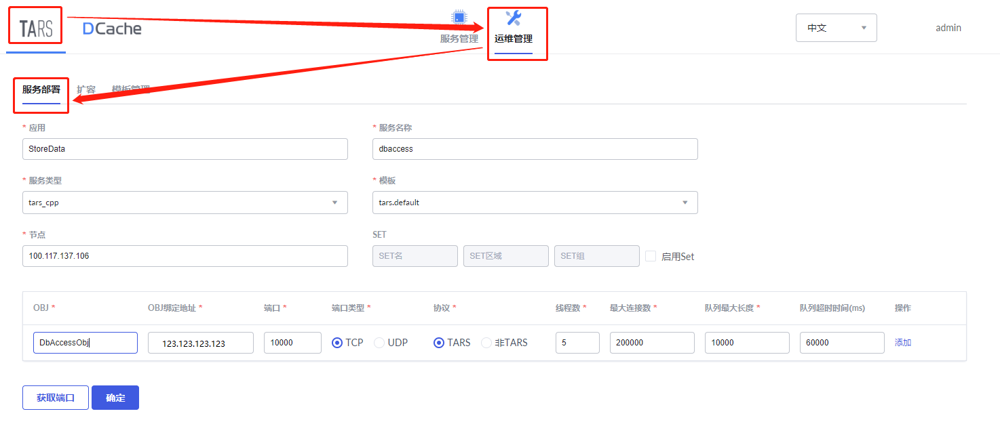
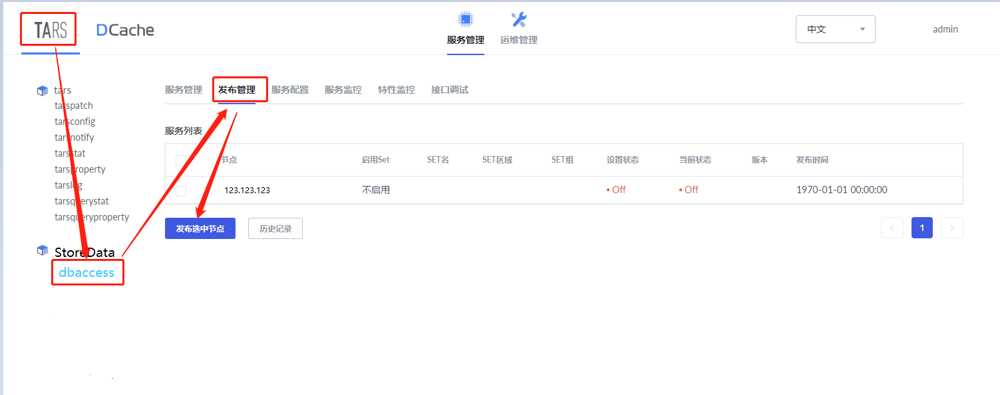

dbaccess是Cache访问持久化服务的代理服务，持久化服务可以是MySQL、SQL Server, PostgreSQL等数据库，针对不同的持久化存储，开发者需要开发不同的dbaccess服务。本篇文档的目标读者是需要实现内存数据持久化存储的相关人员。

Cache通过以下两种方式实现数据持久化：
> 1. 定期将脏数据写入db中
> 2. 在内存不足时，根据lru算法将最‘冷’数据写入到db中

下面以使用MySQL作为持久化存储为例，展示如何开发、部署DbAccess，以及配置DCache开启持久化功能。

> * [提供MySQL DB实例和数据表](#1)
> * [开发一个基于tars的dbaccess服务](#2)
> * [相关配置](#3)
> * [部署dbaccess服务](#4)

## <a id = "1"></a> 1. 提供MySQL DB实例和数据表

**step1: 提供MySQL DB实例**

如果没有，请参考官方文档安装。

**step2：建表** 

一个模块对应一张表。

假设你有一个key-value模块，其中key是身份ID，value是地址信息，那么建表时就要创建3个字段：person_ID，person_Address，sDCacheExpireTime，其中字段“sDCacheExpireTime”是DCache要求增加的一个额外字段，表示过期时间。


假设你有一个k-k-row模块，其中主key是身份ID，联合key是课程ID，value是成绩，那么建表时就要指定4个字段：person_ID，course_ID，score，sDCacheExpireTime，其中字段“sDCacheExpireTime”是DCache要求增加的一个额外字段，表示过期时间。


## <a id = "2"></a> 2. 开发一个基于tars的dbaccess服务

dbaccess服务是DCache访问MySQL的代理，在dbaccess服务中通过访问MySQL从而实现数据的持久化。要求阅读本节的读者已经掌握开发一个tars服务的基本流程。

在DCache的源码中已经提供了一个简洁版的[dbaccess服务](https://github.com/Tencent/DCache/tree/master/src/DbAccess/example)，读者可参考并完善(接口声明文件[DbAccess.tars](https://github.com/Tencent/DCache/blob/master/src/DbAccess/example/DbAccess.tars)请勿修改，DbAccess服务必须实现该文件中的接口)，然后编译生成发布包。


## <a id = "3"></a> 3. 相关配置

发布dbaccess服务前，需要作一些相应的配置，修改配置后需重启服务才能生效。

#### 3.1. 配置dbaccess服务
dbaccess服务的配置可参考库中的[DbAccess.conf文件](https://github.com/Tencent/DCache/blob/master/src/DbAccess/example/DbAccess.conf)，主要包括MySQL实例的用户名，密码和端口等信息。

#### 3.2. 配置Cache服务

配置Cache服务分两种场景：**新建模块**接入dbaccess和**已有模块**接入dbaccess。

##### 3.2.1 新模块接入dbaccess服务
在新建模块时，应用场景选择“cache + 持久化”，并填写相应的Obj信息，如下图所示：



ObjName可以通过点击“管理Servant”获取，如下图所示：




##### 3.2.2 已有模块接入dbaccess服务

修改Cache模块的Main/DbAccess 配置项：

```
1. DBFlag = Y, 
2. ReadDbFlag = Y, 
3. ObjName =  已部署的DbAccess服务的obj信息，例如StoreData.dbaccess.DbAccessObj
```


##### 3.2.3 其他配置项
以下几个配置（包括但不限于）和数据持久化相关

```
1. Main/Cache<EnableErase> = Y/N // 当容量达到阈值时，是否允许自动淘汰旧的数据
2. Main/Cache<EraseInterval> = 5 // 每次淘汰数据的时间间隔（秒）
3. Main/Cache<SyncThreadNum> = 1 // 回写脏数据的线程数，线程越大，回写越快，DB压力越大
4. Main/Cache<SyncTime> = 300 // 回写时间（秒），即回写多久以前的数据，时间越大，保留脏数据越多
5. Main/Cache<SyncInterval> = 100 // 回写操作的时间间隔（秒），即频率
```

## <a id = "4"></a> 4. 部署dbaccess服务
生成dbaccess服务的发布包和做好相关配置后，就可以在tars管理平台部署该服务了。

**step1：** 服务部署



**step2：** 发布服务



上传在[开发一个基于tars的dbaccess服务](#2)生成的发布包。