# 安装DCache

> * [依赖环境](#1)
> * [准备工作](#2)
> * [公共服务部署](#3)
>   * [安装OptServer](#3.1)
>   * [安装ConfigServer](#3.2)
>   * [安装PropertyServer](#3.3)
> * [一键安装DCache基础包](#4)
> * [创建一个DCache应用](#5)
>   * [发布包上传](#5.1)
>   * [部署和发布Proxy和Router服务](#5.2)
>   * [上线一个KVCache模块](#5.3)
>   * [上线一个MKVCache模块](#5.4)
>   * [Cache配置管理](#5.5)


## <a id = "1"></a> 1. 依赖环境

DCache(>=2.1.0)是基于[Tars](https://github.com/TarsCloud/Tars)框架（版本v2.4.2以上）开发，所以编译之前请先安装Tars开发环境和管理平台，安装步骤请参考[Tars的install文档](https://github.com/TarsCloud/Tars/blob/master/Install.zh.md)。安装完Tars管理平台后，在浏览器中访问管理平台主页，如下图：

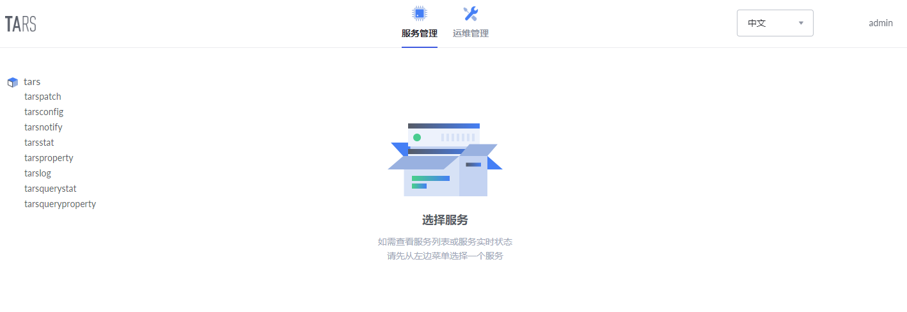

## <a id = "2"></a> 2. 准备工作

### 2.1 编译

在源码目录执行：`mkdir build; cd build; cmake ..; make; make release; make tar`

即可生成各服务的发布包。

### 2.2 创建模板

在Tars的Web平台创建DCache.Cache模板，后续部署DCache模块时会用到该模板, 如果已经存在, 则忽略这步骤

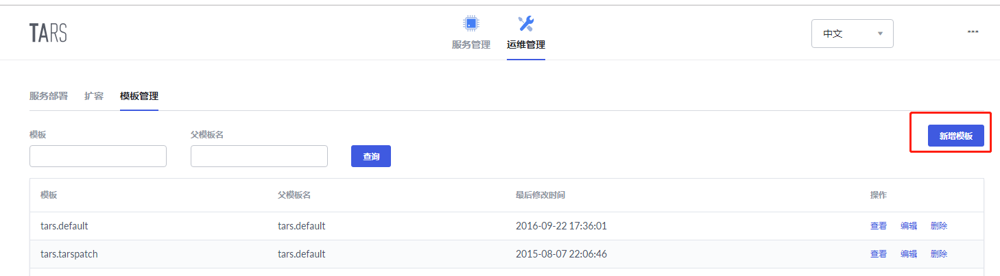

新增模板DCache.Cache，父模板选择tars.default，模板内容填入：

```xml
<tars>
    <application>
        <client>
            property=DCache.PropertyServer.PropertyObj
        </client>
    </application>
</tars>
```

## <a id = "3"></a> 3. 公共服务部署
在正式安装DCache应用前需要部署和安装公共服务：OptServer、ConfigServer和PropertyServer。

### <a id = "3.1"></a> 3.1 安装OptServer
**step1：** 创建OptServer所依赖的数据库，具体步骤可参考[OptServer运行环境搭建](optserver.md)

**step2：** 服务部署。在Tars管理平台主页点击“运维管理”，如下图：

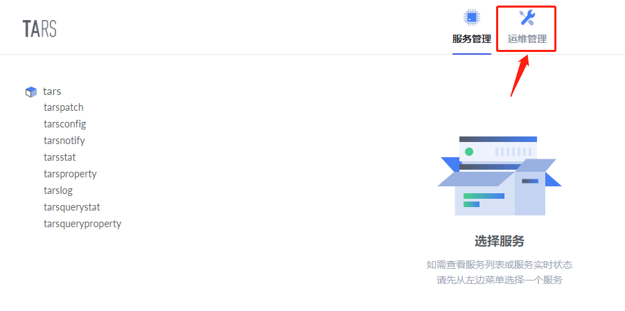

然后填写必要的信息，如下图：

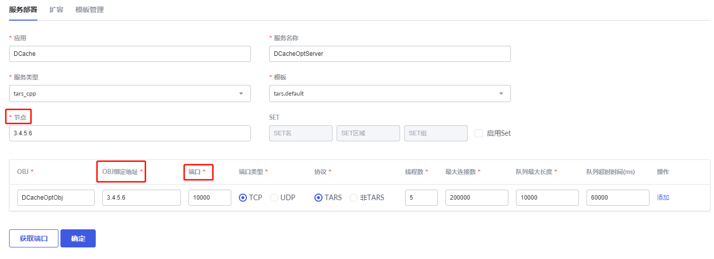

以上信息除“节点”、“OBJ绑定地址”和“端口号”外，**其他必须和上图保持一致**；“节点”填写欲安装OptServer服务的机器IP，“OBJ绑定地址”和“节点”一致，“端口号”可点击右下角“获取端口”按钮自动获取。一路点击“确定”，等待服务部署完成，最后回到Tars管理平台主页，可看到OptServer已经成功部署，如下图：

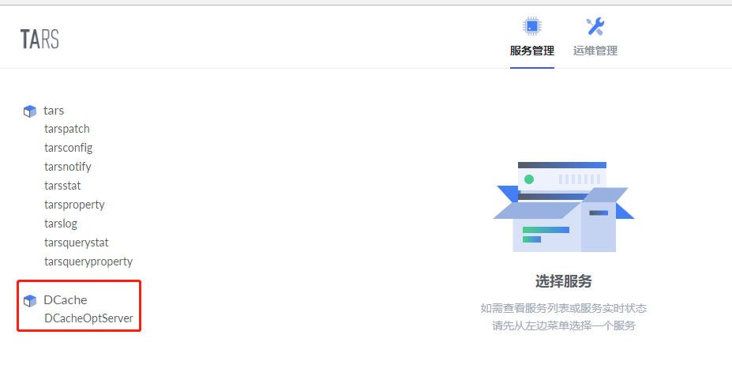

**step3：** 上传发布包。

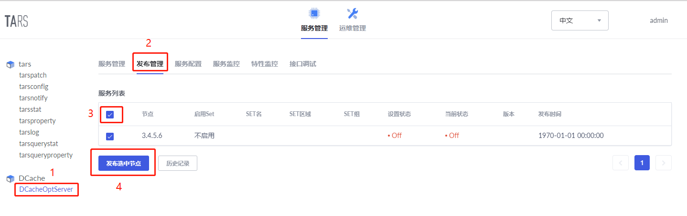

根据上图数字序号，依次点击，得到如下提示框：

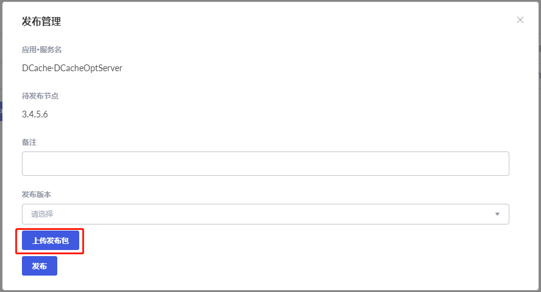

点击“上传发布包”，在新的提示页面上传DCacheOptServer.tgz发布包，得到如下页面：

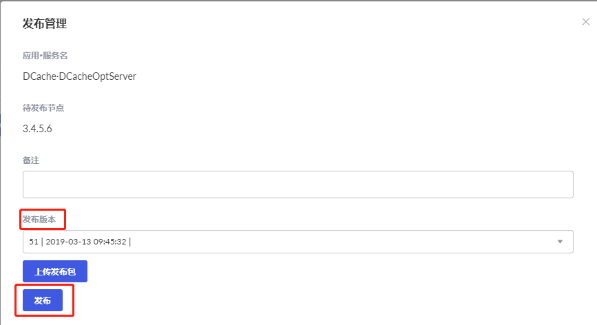

点击“发布版本”下的输入框，选择目标发布包，然后点击“发布”，如发布成功，会显示如下页面：

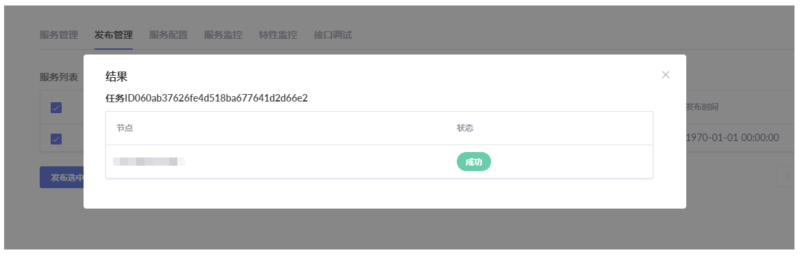

**step4：** 添加配置文件。

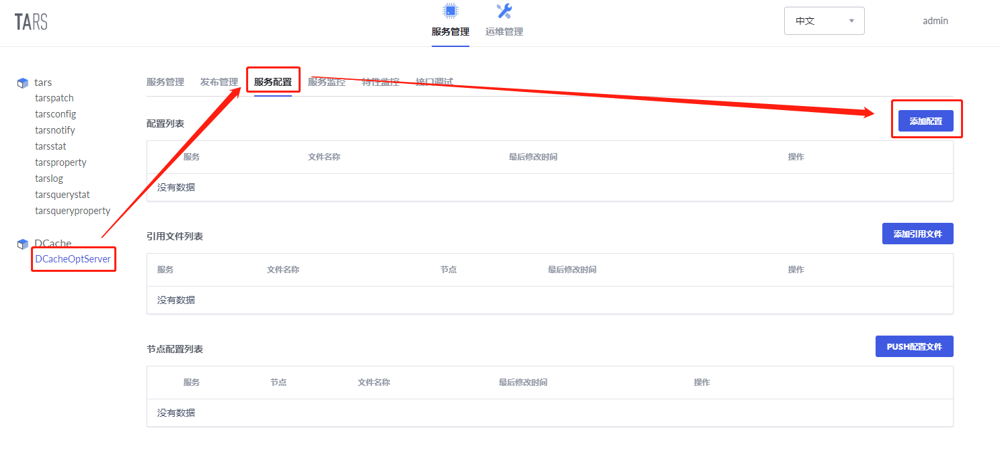

根据上图，依次点击，得到下图：

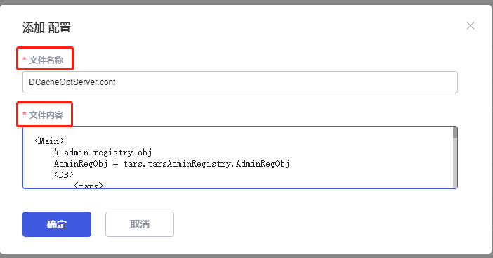

其中文件名称填“DCacheOptServer.conf”，文件内容的填写请参考[DCache服务配置说明](server_config_example.md)。

**step5：** 重启OptServer。

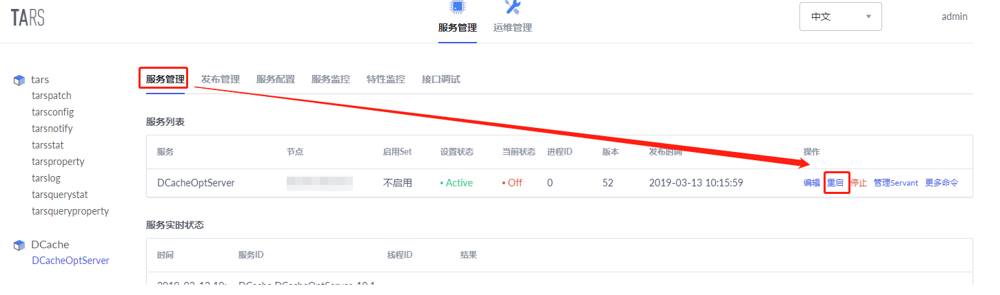

根据上图，依次点击，重启OptServer，重启成功后，“当前状态”从“Off”变成“Active”，如下图所示：

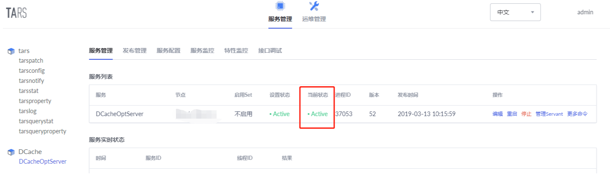


### <a id = "3.2"></a> 3.2 安装ConfigServer

安装ConfigServer的步骤和安装OptServer的步骤类似，除了不需要创建数据库外。

**step1：** 服务部署。服务部署所填信息如下图：

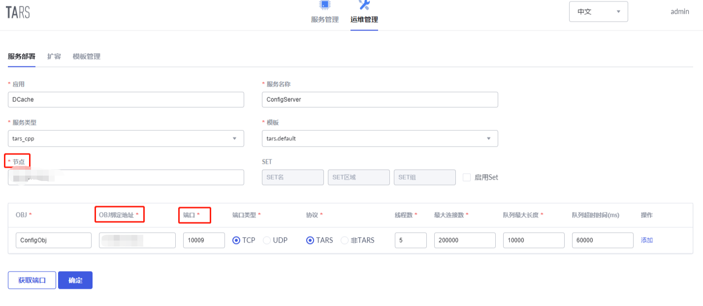

以上信息除“节点”、“OBJ绑定地址”和“端口号”外，**其他必须和上图保持一致**；“节点”填写欲安装ConfigServer服务的机器IP，“OBJ绑定地址”和“节点”一致，“端口号”可点击右下角“获取端口”按钮自动获取。

**step2：** 上传发布包。

该步骤参考安装OptServer的**step3**即可。

**step3：** 添加配置文件。

该步骤参考安装OptServer的**step4**即可。其中配置文件的名称填“ConfigServer.conf”，文件内容的填写请参考[DCache服务配置说明](server_config_example.md)。

**step4：** 重启ConfigServer。

该步骤参考安装OptServer的**step5**即可。  


### <a id = "3.3"></a> 3.3 安装PropertyServer

安装PropertyServer的步骤和安装OptServer的步骤类似，除了不需要创建数据库外。

**step1：** 服务部署。服务部署所填信息如下图：

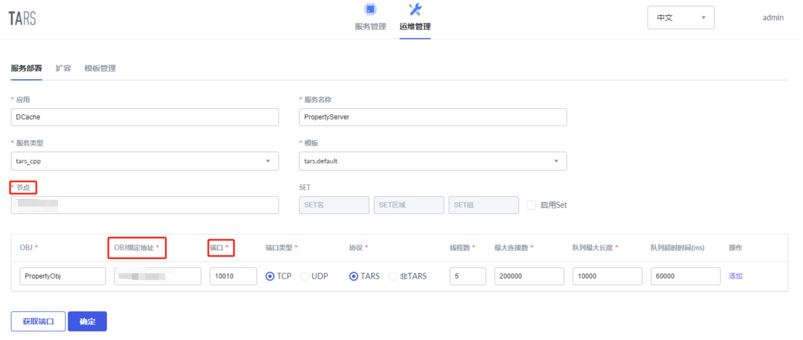

以上信息除“节点”、“OBJ绑定地址”和“端口号”外，**其他必须和上图保持一致**；“节点”填写欲安装PropertyServer服务的机器IP，“OBJ绑定地址”和“节点”一致，“端口号”可点击右下角“获取端口”按钮自动获取。

**step2：** 上传发布包。

该步骤参考安装OptServer的**step3**即可。

**step3：** 添加配置文件。

该步骤参考安装OptServer的**step4**即可。其中配置文件的名称填“PropertyServer.conf”，文件内容的填写请参考[DCache服务配置说明](server_config_example.md)。PropertyServer需要将特性监控数据存储到db中，请自行创建db_dcache_property，并将db信息填入配置文件。

**step4：** 重启PropertyServer。

该步骤参考安装OptServer的**step5**即可。  

## <a id = "4"></a> 4. 一键安装DCache基础包

DCache依赖Tars环境, 因此安装时需要知道TARS数据库, 同时DCache也会有自己的数据库, 会创建dcache相关的表.

进入build目录(必须在build下执行)
```
cd build
../deploy/install.sh TARS_MYSQL_IP TARS_MYSQL_PORT TARS_MYSQL_USER TARS_MYSQL_PASSWORD DCACHE_MYSQL_IP DCACHE_MYSQL_PORT DCACHE_MYSQL_USER DCACHE_MYSQL_PASSWORD WEB_HOST WEB_TOKEN
```

注意:
TARS_MYSQL_IP: tars数据库的ip
TARS_MYSQL_PORT: tars数据库的port
TARS_MYSQL_USER: tars数据库的user
TARS_MYSQL_PASSWORD: tars数据库的密码
DCACHE_MYSQL_IP: dcache数据库的ip
DCACHE_MYSQL_PORT: dcache数据库的port
DCACHE_MYSQL_USER: dcache数据库的user
DCACHE_MYSQL_PASSWORD: dcache数据库的密码
WEB_HOST: TARS web平台地址
WEB_TOKEN: TARS web平台token(需要进入web平台, 用户中心上, 创建一个Token)

执行install.sh脚本后, DCache所有基础环境就准备完毕了:
- Router、Cache、Proxy等发布包已经上传
- DCacheOptServer/PropertyServer/ConfigServer的配置和服务包已经上传

下一步就可以创建DCache的模块了.

## <a id = "5"></a> 5. 创建一个DCache应用

> 本节描述如何创建一个DCache应用，如何上传发布包，如何上线一个模块，并对模块进行配置。
>
> 名词解释
>
> * 模块：类似于mysql中table的概念，使用者创建一个模块来存储数据。模块分为KVCache和MKVCache两种，如果要存储key-value数据则创建KVCache模块，如果要使用k-k-row，list，set，zset则创建MKVCache模块。
> * 应用：应用是多个模块的集合，应用下所有模块共享Proxy和Router服务，类似于mysql中db的概念。

### <a id = "5.2"></a> 5.2 部署和发布Proxy和Router服务

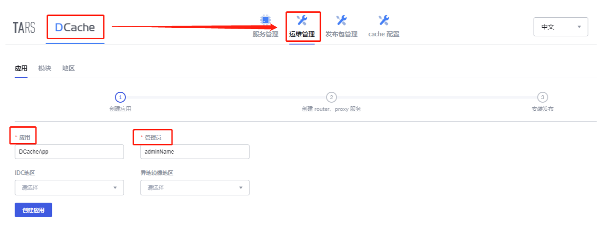

根据上图，依次点击“服务创建”，自定义“应用”名称，然后点击“创建应用”，得到下图：

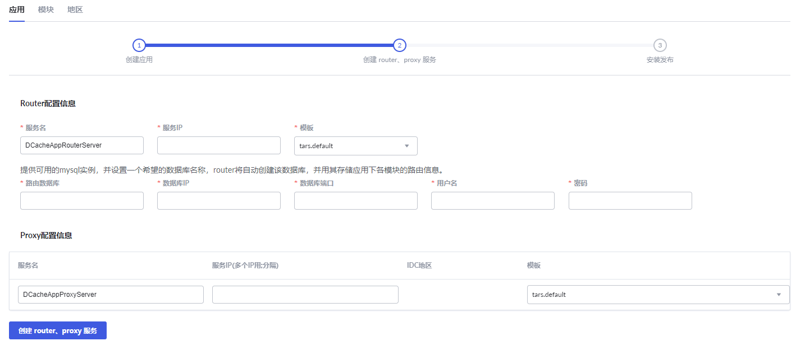

在输入框填写相关信息，其余保持不变，点击“创建router、proxy服务”，得到下图：

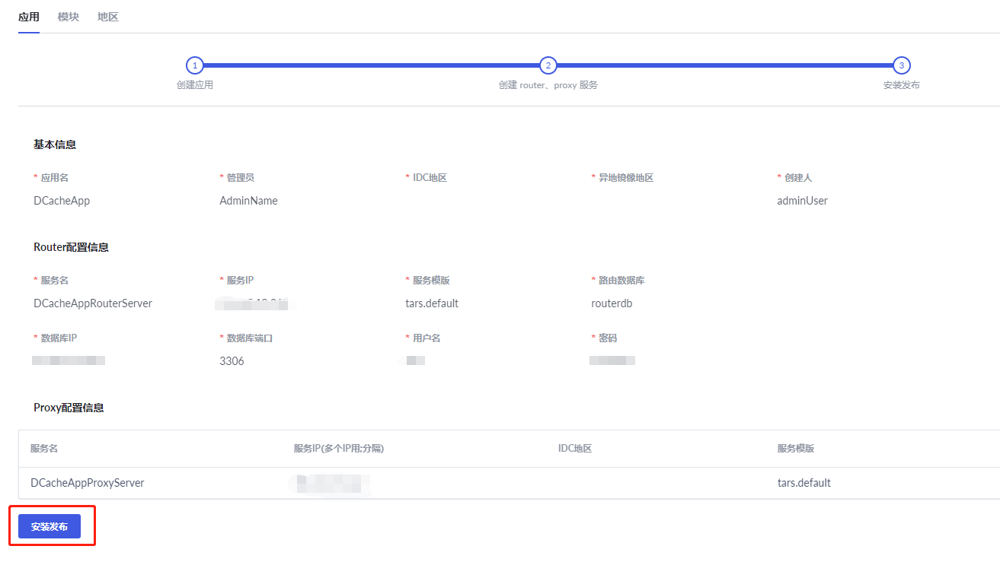

确认填写无误后，点击“安装发布”，等待安装完成，结果如下图所示：

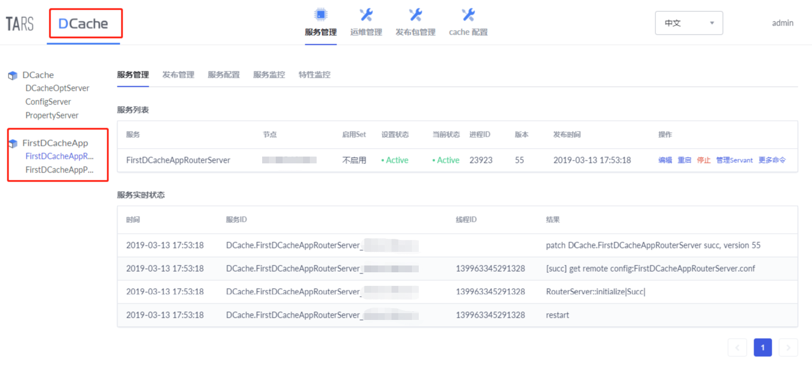


### <a id = "5.3"></a> 5.3 上线一个KVCache模块

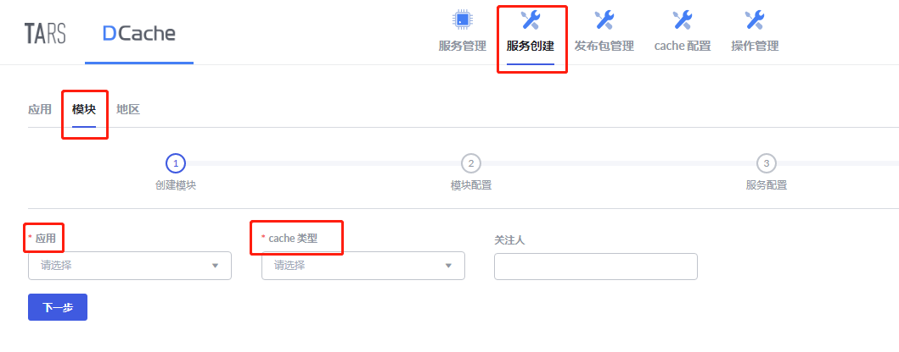

按照上图箭头依次点击，“应用”选择在[部署和发布Proxy和Router服务](#5.2)创建的应用名称，“cache类型”选择KVCache，所填信息确认无误后，点击“下一步”进入“模块配置”步骤，如下图：

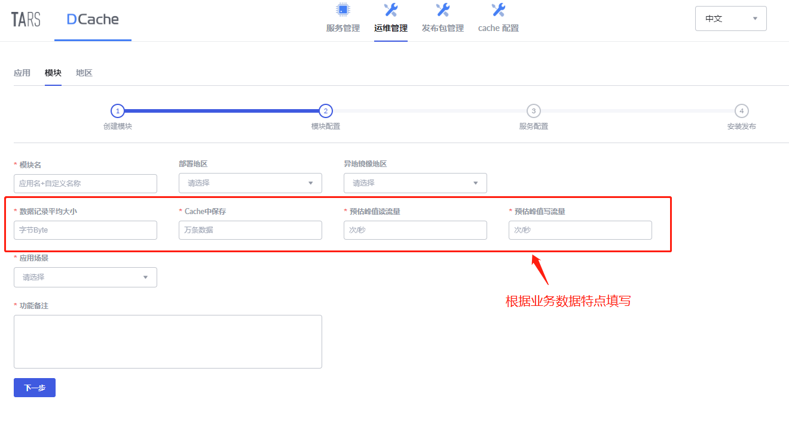

填写必要信息之后，点击“下一步”，进入“服务配置”步骤，如下图：

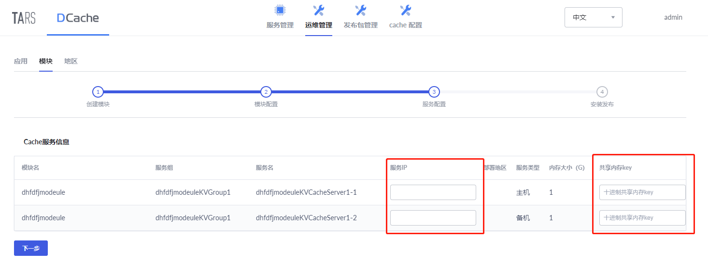

**注意：** <font color=red>共享内存key必须是唯一的，不能在服务部署机器上已存在，否则会造成服务拉起失败，可使用**ipcs**命令确认。</font>  

Cache服务的模板默认会选择DCache.Cache，如果模板DCache.Cache不存在，可创建该模板或者选择其他可用的模板，模板中必须配置property，这样才能查看服务的特性监控数据。

```xml
<tars>
    <application>
        <client>
            property=DCache.PropertyServer.PropertyObj
        </client>
    </application>
</tars>
```

必要信息填写完毕，点击“下一步”进入“安装发布”步骤，等待服务发布完成。刷新管理平台主页，左侧目录树出现此模块信息，如下图：

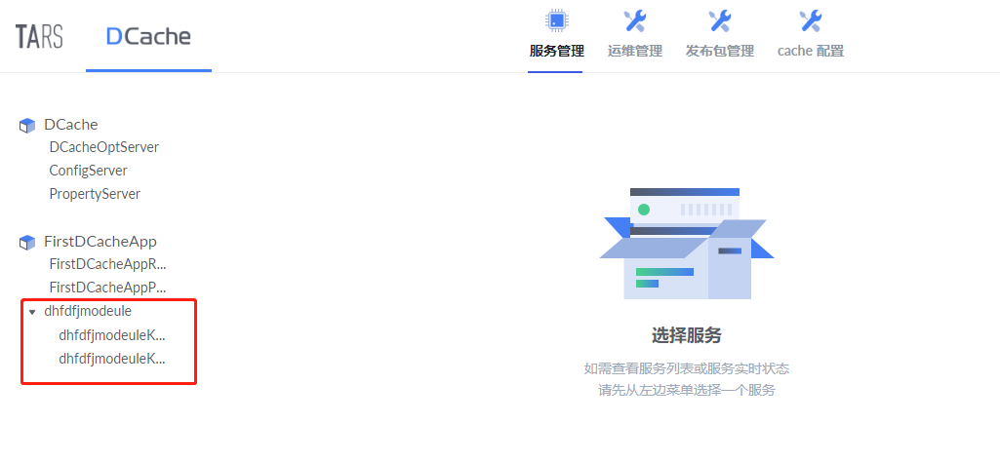

### <a id = "5.4"></a> 5.4 上线一个MKVCache模块

步骤和[部署和发布KVCache](#5.3)类似，参考即可。

### <a id = "5.5"></a> 5.5 Cache配置管理

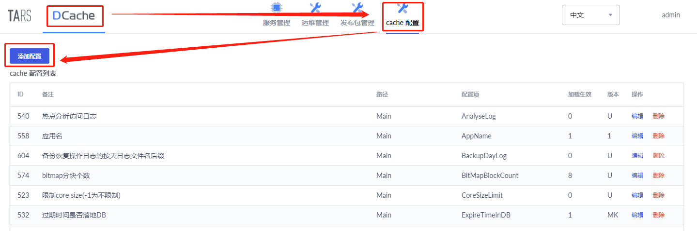

按照上图箭头依次点击，可添加配置项。

#### 模块和单节点的配置管理

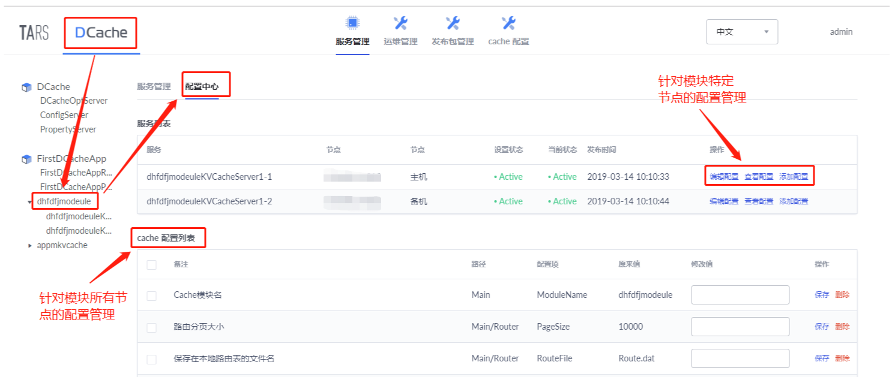

按照上图箭头依次点击，可在该页面上修改和添加配置。该页面的配置管理分两种类型：针对模块所有节点的配置管理和针对模块特定节点的配置管理。如果节点配置和模块配置有重叠的配置项，那么节点配置将覆盖模块配置。
**注意：** <font color=red>修改配置后，需要重启服务才能生效。</font>  
